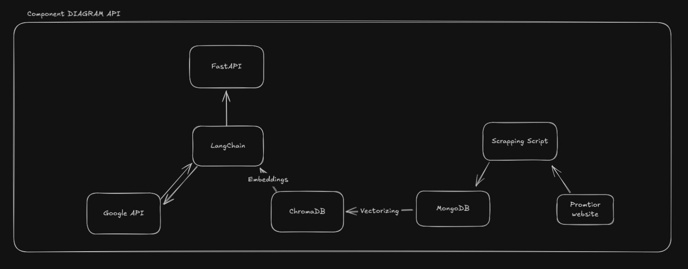

# 🚀 Chatbot Response System

## 📖 Project Overview
I structured the project as follows:

1. **Data Collection**
2. **Classification**
3. **Chatbot Development**
4. **Deployment on AWS**

To gather the necessary data, I developed a script to scrape the entire Promtior website, extracting as much information as possible. Interestingly, this process led me to discover hidden sections of the website that should not be publicly accessible, which could be useful to present as a finding.

After collecting and classifying the data, I proceeded to develop the chatbot. Integrating it with FastAPI for web usage was relatively straightforward. I assumed that a graphical interface was not required, as there was no mention of it in the provided documentation.

My primary focus was on the **information quality**. Notably, the company's foundation year was missing from the website, so I manually added it to the database to ensure completeness.

## ⚠️ Main Challenges & Solutions
- **Getting a free trial for Azure** → I couldn't resolve this, so I opted for AWS instead.
- **Library compatibility issues with Docker** → Successfully resolved.
- **Opening ports in AWS** → Managed to open a port for the server to respond, achieving a successful deployment.

## 📌 API Deployment  
If you want to see the API documentation or test the chatbot, you can check it here:  
[API Docs](http://ec2-3-143-254-44.us-east-2.compute.amazonaws.com:8000/docs)

```sh
http://ec2-3-143-254-44.us-east-2.compute.amazonaws.com:8000
```

## 🛠️ Component Diagram
The following diagram illustrates the interaction between the system components:



## 🚀 Technologies Used
- Python + FastAPI
- Web Scraping (BeautifulSoup / Scrapy)
- LLM Model Integration
- AWS for Deployment
- Docker for Containerization
- Excalidraw for Diagrams
- MongoDB
- LangChain
- Google API

## 🔧 Installation & Usage
1. Clone the repository:
   ```sh
   git clone https://github.com/your-repo/chatbot-system.git
   ```
2. Install dependencies:
   ```sh
   pip install -r requirements.txt
   ```
3. Run the server:
   ```sh
   uvicorn app:app --reload
   ```

